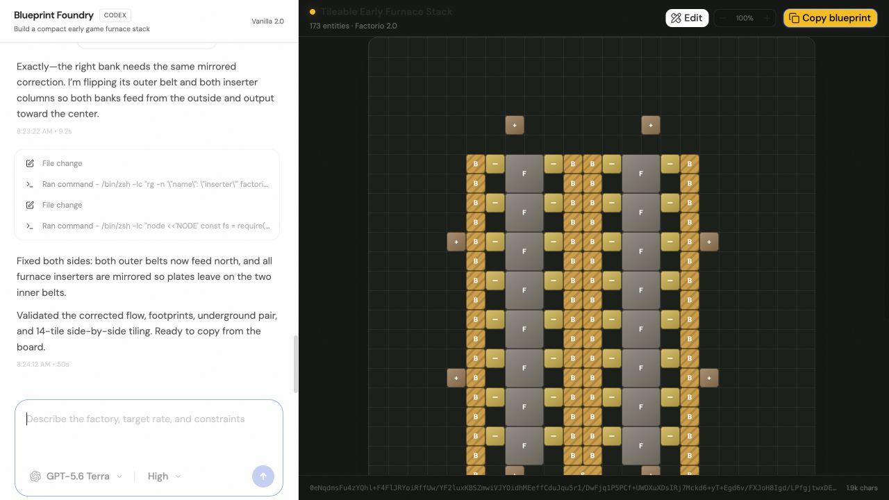

# Blueprint Foundry

Describe a Factorio factory to Codex. Blueprint Foundry researches the ratios, turns the design into a tile layout, renders it on a board, and gives you a Factorio 2.0 blueprint string to copy.



This is a focused fork of [T3 Code](https://github.com/pingdotgg/t3code). It keeps T3 Code's local Codex app-server integration and chat history, then replaces the general coding workspace with a Factorio blueprint artifact and board.

## Run it

You need the [Codex CLI](https://developers.openai.com/codex/cli) installed and signed in.

```bash
mise install
mise x -- bun install
mise x -- bun dev
```

The app opens in your browser. Try a request such as:

> Build a compact early-game green circuit line using yellow belts. Leave room to extend it later.

Codex writes `factorio-blueprint.json` in the current workspace. The board validates the file, redraws within a second, and creates the compressed import string. Click **Copy blueprint**, then use Factorio's **Import string** action.

Click **Edit** to open the integrated [Trisiak Factorio Blueprint Editor](https://github.com/trisiak/factorio-blueprint-editor). It loads the current blueprint with real Factorio 2.0 sprites. **Use edits** returns the modified string to the board's copy flow. Manual edits persist in this browser until Codex writes a newer source blueprint.

## Current scope

Blueprint Foundry supports the common vanilla 2.0 machines, belts, inserters, power poles, chests, pipes, labs, beacons, and basic power entities. The server rejects unknown prototypes, overlapping footprints, invalid directions, and malformed underground-belt endpoints before offering an export string.

The board is a structural preview. Factorio remains the final authority for recipe names, fluid-box connections, circuit wiring, and modded entities.

## Credits

- Based on [T3 Code v0.0.12](https://github.com/pingdotgg/t3code), copyright 2026 T3 Tools Inc., used under the MIT License.
- The visual Factorio 2.0 builder comes from [Trisiak's Factorio Blueprint Editor](https://github.com/trisiak/factorio-blueprint-editor), a maintained fork of [Teoxoy's original editor](https://github.com/Teoxoy/factorio-blueprint-editor), copyright 2020 Tanasoaia Teodor Andrei, used under the MIT License.

See [THIRD_PARTY_NOTICES.md](THIRD_PARTY_NOTICES.md) for license and game-asset details.
